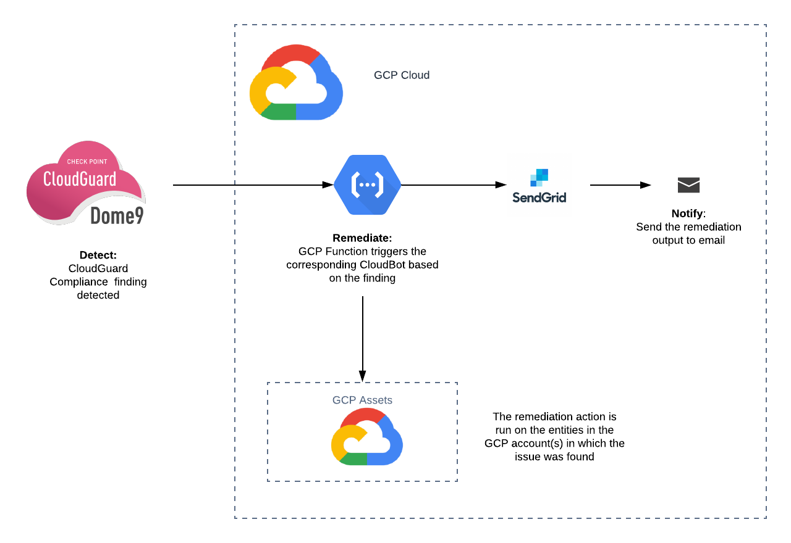
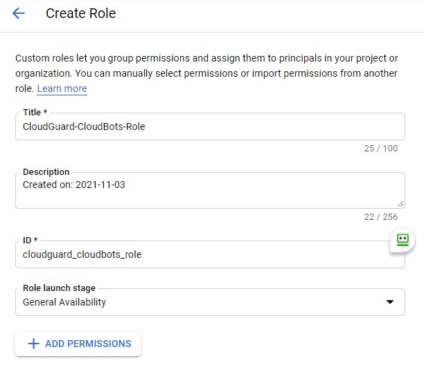
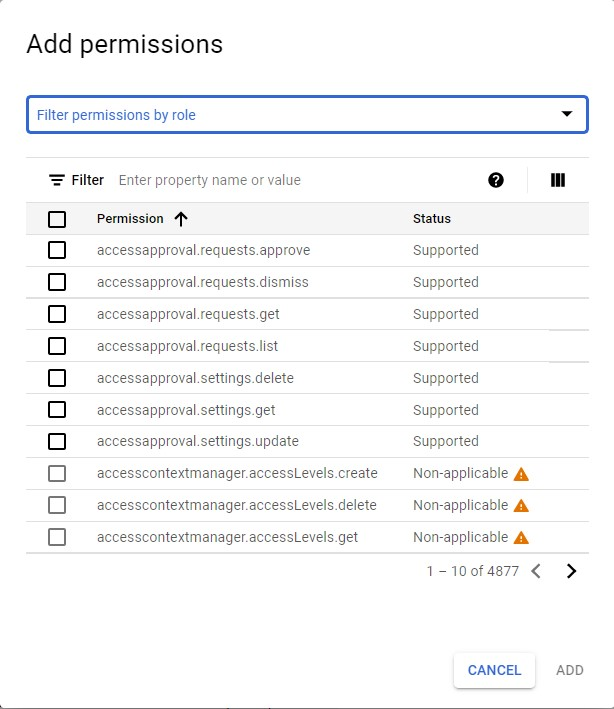
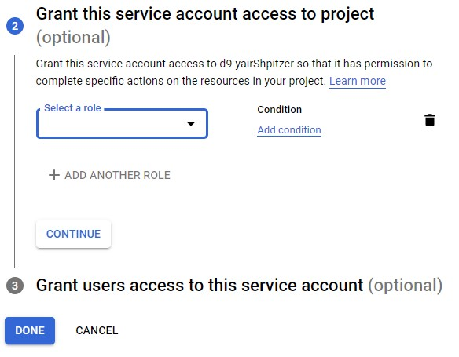
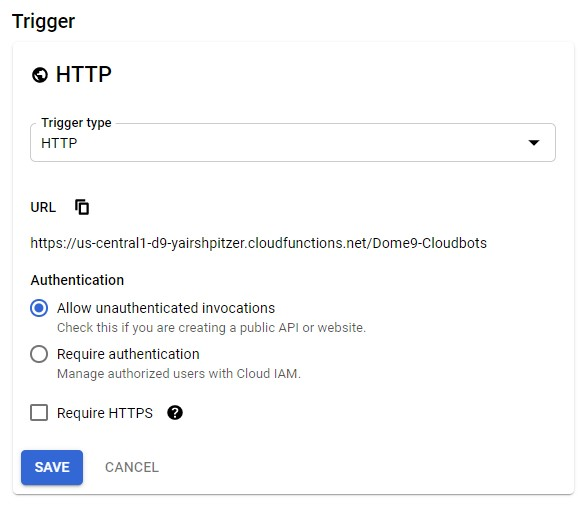
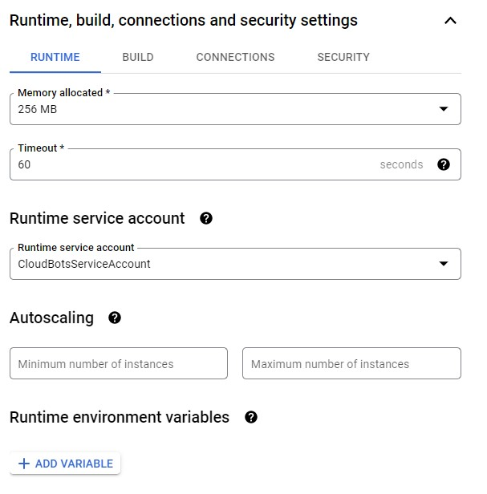
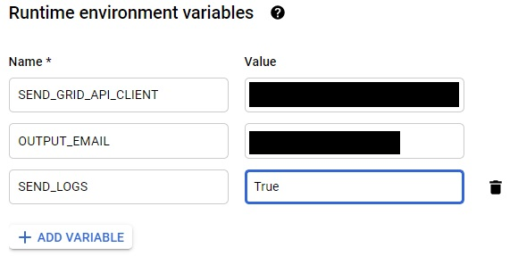
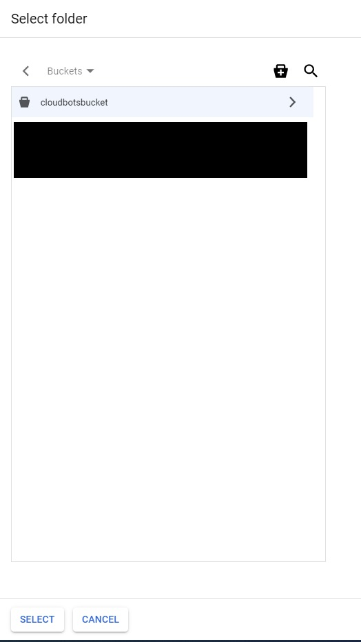
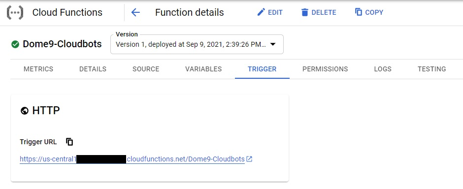
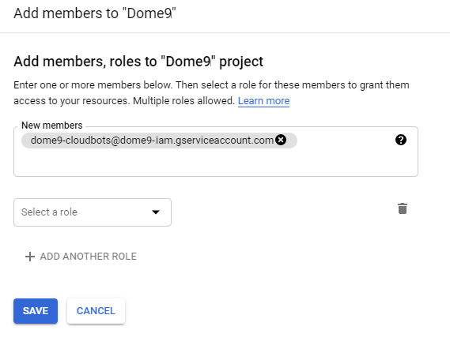

    

    <h1><a target="_blank" href="https://cloudbots.dome9.com">CloudBots</a> is an automatic remediation solution for public cloud platforms (GCP, <a href="https://github.com/Dome9/cloud-bots" target="_blank">AWS</a>, and <a href="https://github.com/Dome9/cloud-bots-azure" target="_blank">Azure</a>)</h1>

  - [What are CloudGuard CloudBots?](#what-are-dome9-cloudbots)
  - [Flow Diagram](#flow-diagram)
      - [The Bots](#the-bots)
  - [Deploy the CloudBots](#deploy-the-cloudbots)
      - [Configure your GCP Projects for
        CloudBots](#configure-your-gcp-projects-for-cloudbots)
          - [Download the CloudBots zip
            file](#download-the-cloudbots-zip-file)
          - [Create GCP Service Account for
            cloudbots](#create-gcp-service-account-for-cloudbots)
          - [Configure SendGrid](#configure-sendgrid)
          - [Create a GCP Function with the
            CloudBots](#create-a-gcp-function-with-the-cloudbots)
          - [Webhook for Function](#webhook-for-function)
      - [Multiple GCP Accounts](#multiple-gcp-accounts)
      - [Configure your CloudGuard account](#configure-your-dome9-account)
          - [Configure a CloudGuard Compliance
            Ruleset](#configure-a-dome9-compliance-ruleset)
          - [Configure a CloudGuard Continuous Compliance
            policy](#configure-a-dome9-continuous-compliance-policy)
  - [Log Collection for
    Troubleshooting](#log-collection-for-troubleshooting)
  - [What are CloudGuard CloudBots?](#what-are-dome9-cloudbots)
      - [Flow Diagram](#flow-diagram)
          - [The Bots](#the-bots)
      - [Onboarding](#onboarding)
          - [Clone repo](#clone-repo)
          - [Create GCP Service Account for
            cloudbots](#create-gcp-service-account-for-cloudbots)
          - [Configure SendGrid](#configure-sendgrid)
          - [Create a GCP Function with the
            CloudBots](#create-a-gcp-function-with-the-cloudbots)
          - [Webhook for Function](#webhook-for-function)
          - [Multiple Accounts](#multiple-accounts)
      - [Configure Dome9](#configure-dome9)
          - [Configure a Ruleset](#configure-a-ruleset)
          - [Configure the Continuous Compliance
            policy](#configure-the-continuous-compliance-policy)
      - [Log Collection for
        Troubleshooting](#log-collection-for-troubleshooting)

## What are CloudGuard CloudBots?

CloudGuard CloudBots are an autoremediation solution for GCP, built on top of
the CloudGuard CloudGuard Continuous Compliance capabilities.

They can also be used standalone, without Dome9, to remedy issues in AWS
and Azure accounts. Details are included how to configure and trigger
them.

# Flow Diagram

## The Bots

Refer to [this](dome9CloudBots/bots/bots.md) file for a list of the
bots, what each one does, and an example of a rule that could be used to
trigger it.

# Deploy the CloudBots

To use the CloudBots, you have to set up your GCP project, and your
CloudGuard account.

## Configure your GCP Projects for CloudBots

Follow these steps to configure your GCP Projects:
    
  - Create a custom role for the CloudBots *Cloud Function*
  - Create a *Service Account* for the CloudBots  
  - download the CloudBots zip file
  - Optionally, configure SendGrid to forward notifications by email
  - Create a GCP Function for the CloudBots

### Create a custom role for the CloudBots *Cloud Function*

1. In GCP portal, go to *IAM & Admin* -> *Roles*
2. Choose *Create Role*
3. Enter a title for the role (like 'CloudGuard-CloudBots-Role')
4. Choose *Role launch stage* to be **General Availability**

    

5. Click on *Add permissions**
6. Add the permissions from the file [CloudGuard-CloudBots-Role.json](CloudGuard-CloudBots-Role.json)
   
    

7. Press *CREATE*

### Create a *Service Account* for the CloudBots

1. In GCP portal, go to *IAM & Admin* -> *Service Accounts*
2. Choose *Create Service Account*
3. Enter a name for the service account (like 'CloudGuard-CloudBots-ServiceAccount')

    

4. Press on *Create and Continue*
5. Choose the role you created in the previous step

    

6. Press *Continue* and the then *Done*

### Download the CloudBots zip file

1.  Download the CloudBots zip file from this repository (The GCP
    Function will require the content zipped).
2.  If you cloned the repository, zip the contents.

### Configure SendGrid

SendGrid ([sendgrid.com](sendgrid.com)) is a third-party email service.
It has different tiers and pricing. It is used by GCP to distribute
emails. See
[here](https://cloud.google.com/compute/docs/tutorials/sending-mail/using-sendgrid)
for more info.

This step is optional.

1.  Navigate to sendgrid.com
2.  Create a new account, following the instructions on the site.
3.  Navigate to *Settings*, and then select *API Keys*.
4.  Click *Create API Key*.
5.  Enter a name for the key (e.g., *Dome9-cloudbots*, an select Full
    Access.
6.  Click *Create Key*, then copy the value of the key.
7.  Click *Done*.

### Create a GCP Function with the CloudBots

1. Navigate to *Cloud Functions*.
2. Click *CREATE FUNCTION*.
   
   
   
3. Choose a name for the function.
4. Select a region for the function.
   
    

5. Set *Trigger Type* as **HTTP**.
6. Check *Allow unauthenticated invocations* option.
7. Press *SAVE*.
   
    

8. Expand *RUNTIME, BUILD, CONNECTIONS AND SECURITY SETTINGS*.
9. Make sure the *Runtime Service Account* is set to the service account you created earlier.
   
    

10. In the *Runtime Environment Variables* section, click on *ADD VARIABLE* and add the following variables:
    1. (optional) SEND_GRID_API_CLIENT - enter the SendGrid API Ket that was created above.
    2. (optional) OUTPUT_EMAIL - the email recipient (for notification emails, generated with SendGrid).
    3. SEND_LOGS - set to *True* to send log information to CloudGuard for troubleshooting; set to *False* to disable this (default is *True*).
    
    

11. Press *NEXT*.
12. Set Runtime as *Python 3.7*.
13. In the *ENTRY POINT* section enter 'main'.
    
    

14. In *SOURCE CODE*, choose **ZIP Upload**.
15. Choose the zip file that was created above.
    
    

16. Choose a *Stage Bucket* (or create a new one if necessary).
    
    

17. Click on *DEPLOY*.

### Webhook for Function

The cloudbot function in GCP is triggered from CloudGuard using a webhook.
For this, the URL of the function is required.

1.  Click on the Cloud Function you created.
2.  Go to *TRIGGER* section.
3. Copy the *Trigger URL*.

## Multiple GCP Accounts

You can use CloudBots for several GCP projects, but install it in only
one project. The other projects will be accessed from the first by
granting IAM permissions.

1.  Create a GCP Function in one of the GCP projects, following the
    steps above.
2.  For each of the other projects, navigate to IAM & admin, and select
    IAM.
    1.  Click ADD.  
        
    2.  In the New members field, enter the service account created
        above.
    3.  Select the Project Editor role.
    4.  Click SAVE.

## Configure your CloudGuard account

On CloudGuard add remediation tags to rules in a Compliance ruleset.

See also

[CloudGuard Dome9
Compliance](https://sc1.checkpoint.com/documents/CloudGuard_Dome9/Documentation/Compliance-and-Governance/Compliance-and-Governance.html)

[Continuous
Compliance](https://sc1.checkpoint.com/documents/CloudGuard_Dome9/Documentation/Compliance-and-Governance/ContinuousCompliance.html)

[Notification
Policies](https://sc1.checkpoint.com/documents/CloudGuard_Dome9/Documentation/Alerts-Notifications/NotPolicy.html)

### Configure a CloudGuard Compliance Ruleset

CloudBots are triggered by findings discovered by CloudGuard Compliance
rulesets. You must configure a ruleset to trigger the CloudBots.

Follow these steps in your CloudGuard account to tag the compliance rules &
rulesets to use bots as a remediation step.

1.  In the CloudGuard web app, navigate to the Rulesets page in the
    Compliance & Governance menu.

2.  Select or create a ruleset that will be used for the cloudbots.

3.  Select the rules for which you want to add a remediation step.

4.  In the Compliance Section add a row with the following string:
    `AUTO: <bot-name> <params>` where *bot-name* is the name of the bot,
    and *params* is a list of arguments for the bot (if any).
    
    For example, `AUTO: vm_instance_stop` will run the bot to stop a VM
    instance.

### Configure a CloudGuard Continuous Compliance policy

Once the rules in the ruleset have been tagged for remediation, set up a
Continuous Compliance policy to run the ruleset, and send findings the
GCP function webhook.

1.  Navigate to the **Policies** page in the Compliance & Governance
    menu.
2.  Click **ADD POLICY** (on the right).
3.  Select the account from the list, then click **NEXT**, this will be
    the one account in which the bots are deployed.
4.  Select the ruleset from the list, then click **NEXT**.
5.  Click **ADD NOTIFICATION**.
6.  Select *Send to HTTP Endpoint* and enter the URL for the Function, as described above  [Webhook for Function](#webhook-for-function), and then click **SAVE**.

**Note:** CloudGuard will send event messages to the webhook for new
findings. To send events for previous findings, follow these steps:

1.  Navigate to the **Policies** page.
2.  Find the ruleset and account in the list, and hover over the right
    of the row, then click on the *Send All Alerts* icon.
3.  Select the *webhook* Notification Type option, and the Notification
    Policy (the one created above), then click **SEND**. CloudGuard will send
    event messages to the GCP function webhook.

# Log Collection for Troubleshooting

The cloudbots send log information to CloudGuard, that is used for
troubleshooting. By default, this is enabled for all bots. You can
disable this in your GCP account. Select the function, and set the
environment variable SEND\_LOGS to False. This will apply to all bots in
the account. By default, this is set to True, enabling logs.

Each account is controlled by the variable for the function configured
in that account.
