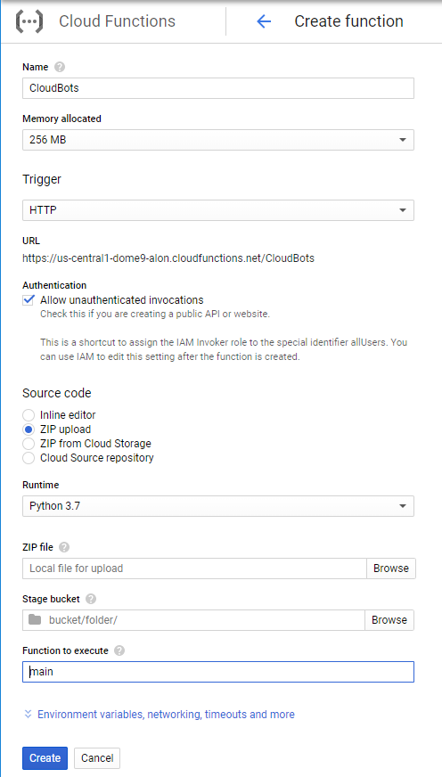
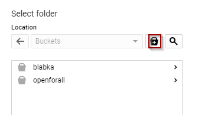

    

    <h1><a target="_blank" href="https://cloudbots.dome9.com">CloudBots</a> is an automatic remediation solution for public cloud platforms (<a href="https://github.com/Dome9/cloud-bots" target="_blank">AWS</a>, <a href="https://github.com/Dome9/cloud-bots-azure" target="_blank">Azure</a>, and GCP)</h1>

- [What are Dome9 CloudBots?](#what-are-dome9-cloudbots)
  - [Flow Diagram](#flow-diagram)
      - [The Bots](#the-bots)
  - [Onboarding](#onboarding)
      - [Setup your Azure account for
        CloudBots](#setup-your-azure-account-for-cloudbots)
      - [Multiple Accounts](#multiple-accounts)
  - [Setup your Dome9 account](#setup-your-dome9-account)
      - [Configure the rules](#configure-the-rules)
      - [Configure the Continuous Compliance
        policy](#configure-the-continuous-compliance-policy)
  - [Log Collection for
    Troubleshooting](#log-collection-for-troubleshooting)
	
## What are Dome9 CloudBots?

Cloud-Bots is an auto remediation solution for GCP, built on top of the
CloudGuard Dome9 Continuous Compliance capabilities.

They can also be used standalone, without Dome9, to remedy issues in AWS
and Azure accounts. Details are included how to configure and trigger them.

# Flow Diagram

## The Bots

Refer to [this](dome9CloudBots/bots/bots.md) file for a list of the bots, what each one
does, and an example of a rule that could be used to trigger it.

# Onboarding

## Clone repo

1. Clone this repo.
1. Zip the contents of the repo, excluding the outer folder (cloud-bots-gcp).

## Create GCP Service Account for cloudbots

1. In the GCP console, navigate to IAM & admin, and then select  Service accounts.
1. Click CREATE SERVICE ACCOUNT to add a service account.

3. Enter a name (e.g., *Dome9-cloudbots*)
1. In the Service Account ID field, enter the name of the service account (in the previous step).

## Configure SendGrid

1. Navigate to sendgrid.com
1. Create a new account, following the instructions on the site.
1. Navigate to *Settings*, and then select *API Keys*.
1. Click *Create API Key*.
1. Enter a name for the key (e.g., *Dome9-cloudbots*, an select Full Access.
1. Click *Create Key*, then copy the value of the key.
1. Click *Done*.

## Create a GCP Function with the CloudBots

1. Navigate to *Cloud Functions*.
1. Click *CREATE FUNCTION*.

3. Enter a name for the function (e.g., *Dome9-Cloudbot*).
1. In the Source Code section, select *ZIP upload*.
1. In the ZIP file section, browse to the location of zip file created above.
1. In the Stage bucket section, click *Browse*.
1. Click *+*, enter a name for the bucket, and then click *CREATE*.

8. In the *Function to execute* section, enter *main*.
1. Click More at the bottom of the navigation menu, on the left.
1. In the Service account field, select the account created above.
1. In the Environment variables section, click Add variable, and add the following variables:
   1. SEND_GRID_API_CLIENT - enter to SendGrid API Key, created above.
   1. OUPTPUT_EMAIL - the email recipient (for notification emails, generated with SendGrid).
   1. SEND_LOGS  - set to True to send log information to Dome9, for troubleshooting; False to disable this (default is True).
1. Click *CREATE* to create the function for the cloudbots.

## Webhook for Function

The cloudbot function in GCP is triggered from Dome9 using a webhook. For this, the URL of the function is required.

1. Navigate to *Cloud Functions*.
1. Select the function created above.
1. Select the *Trigger* tab. The trigger type should be HTTP.
1. Copy the URL.

## Multiple Accounts

You can use CloudBots for several GCP projects, but install it in only one project. The other projects will be accessed from the first by granting IAM permissions.

1. Create a GCP Function in one of the GCP projects, following the steps above.
1. For each of the other projects, navigate to IAM & admin, and select IAM.
   1. Click ADD.   
   
   2. In the New members field, enter the service account created above.
   1. Select the Project Editor role.
   1. Click SAVE.

# Configure Dome9 

On Dome9 you must add remediation tags to rules in a compliance ruleset.

## Configure a Ruleset

Follow these steps in your Dome9 account to tag the compliance rules &
rulesets to use bots as a remediation step.

1.  In the Dome9 console, navigate to the Rulesets page in the
    Compliance & Governance menu.

2.  Select the rules for which you want to add a remediation step.

3.  In the Compliance Section add a row with the following string:
    `AUTO: <bot-name> <params>` where *bot-name* is the name of the bot,
    and *params* is a list of arguments for the bot (if any).
    
    For example, `AUTO: vm_instance_stop` will run the bot to stop an
    EC2 instance.

## Configure the Continuous Compliance policy

Once the rules in the ruleset have been tagged for remediation, set up a
Continuous Compliance policy to run the ruleset, and send findings the Azure function webhook.

1.  Navigate to the **Policies** page in the Compliance & Governance
    menu.
2.  Click **ADD POLICY** (on the right).
3.  Select the account from the list, then click **NEXT**, this will be the one account in which the bots are deployed.
4.  Select the ruleset from the list, then click **NEXT**.
5.  Click **ADD NOTIFICATION**.
6.  Select *Webhook integration* and enter the URL for the Function, as described above  [Webhook for Function](#webhook-for-function), and then click **SAVE**.

**Note:** Dome9 will send event messages to the webhook for new findings. To
send events for previous findings, follow these steps:

1.  Navigate to the **Policies** page.
2.  Find the ruleset and account in the list, and hover over the right
    of the row, then click on the *Send All Alerts* icon.
3.  Select the *webhook* Notification Type option, and the Notification
    Policy (the one created above), then click **SEND**. Dome9 will send
    event messages to the GCP function webhook.

# Log Collection for Troubleshooting

The cloudbots send log information to Dome9, that is used for troubleshooting. By default, this is enabled for all bots. You can disable this in your Azure account. Select the  function, and set the environment variable SEND_LOGS to False. This will apply to all bots in the account. By default, this is set to True, enabling logs.

Each account is controlled by the variable for the function configured in that account.

